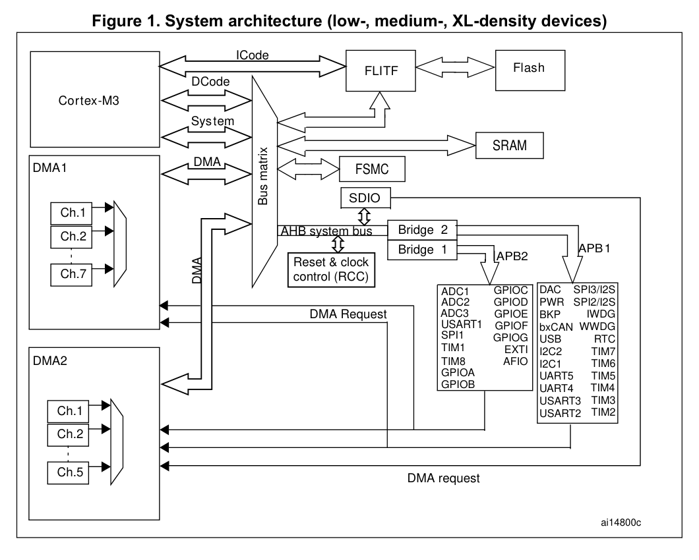

# 硬件与地址

## 硬件组织

对于一个普通程序员，通常打交道的只有内存和各种高度抽象的软件接口，硬件似乎是相当陌生的东西。归根究底，一个程序如何访问到硬件的呢？操作系统怎么知道有哪些硬件呢？

我们不妨参考广泛使用的单片机 STM32F10 系列。（感兴趣可以看《STM32中文参考手册V10》）

如图所示，包括内存、闪存在内的所有设备通过各种总线连到 CPU 核心 (Cortex M3) 上。程序存储器、数据存储器、寄存器和输入输出端口被组织在同一个 4GB 的线性地址空间内。例如

| 地址 | 设备 |
| - | - |
| 0x5000 0000 – 0x5003 FFFF | USB OTG 全速 |
| 0x4001 0000 - 0x4001 23FF | GPIO 与 AFIO |
| 0x4000 0000 - 0x4000 23FF | TIM 定时器 |
| 0x2000 0000 - 0x2001 8000 | SRAM |
| 0x0800 0000 - 0x0807 FFFF | Flash |

还有很多其他设备不再赘述。可以看到 STM32 的世界里一切都是硬编码的，硬件访问通过访问特定物理地址进行，每个设备有固定的中断号。

而 x86 单片机大部分 IO 与特定“IO 端口”绑定，与内存地址空间相互独立；实质也是类似的，即通过总线寻址、操作、读写。

若要写一个与设备交互的程序，只需查文档，找到对应地址和用法，搓就完了；多简单！

对于嵌入式设备，这是最好的做法，代码又少又简单；但对于一个通用的操作系统，世界上有那么多种类的硬件系统，全部硬编码进内核显然不现实。因此需要一种动态加载设备列表的机制。

现代常用机制有两个：Device Tree Blob (DTB) 和 Advanced Configuration and Power Interface (ACPI)；这在后面的设备章节会详细介绍。他们由绑定在机器上的 bios/uefi 维护，在引导式传递给 bootloader/内核。

这些机制能够提供硬件信息，例如内存、总线、设备，让我们的操作系统加载对应驱动、使用对应设备。特别地，他们会提供 PCIe bus 信息从而让系统能进而枚举 PCIe 设备；提供 USB hub 信息让系统进而监测加载 USB 设备；甚至设备加载可以嵌套，可以有一个 USB 设备是 USB hub，内核可以通过此 USB 设备再加载 USB 设备。由此，各种设备呈树状组织（上面 stm32 图可见），形成设备树。

但在内核里设备一般并非按照物理连接方式组织，而是通过用途分类而平铺在设备列表中（可见 Linux 上的 `/dev` 文件夹和 Windows 的设备管理器）。

相应硬件的操作方式还是要通过文档搓出来，编码到内核中或者作为驱动/内核模块加载。独立的设备种类比硬件系统种类是少多了，但还是会占内核代码里相当大的比重（据说超过 70%）。

设备被驱动加载归类后，通过特定的系统调用使用。在 Linux 用户态，一台字符流设备会通过 ioctl, netlink 两种方式使用（前者对应指令密集型设备，后者对应传输密集型设备），一台块设备（有固定容量、可随机访问）可以通过文普通文件操作和 mmap 使用。

## 地址空间

CPU 通过总线和内存、硬盘等外部组件相连，通过寻址定位到特定组件而与之交互。

所有架构里“内存”都是一等公民，有很多基本指令都是用来访存、写存的，也就有了“内存地址”的概念（对应指针）。对于其他设备，早期 x86 选择独立出一些“端口”操作，将一些设备绑定到特定端口上；现代的大部分架构选择 memory mapped i/o，即把设备绑定到特定地址上。至此，“地址”不再是内存独享，而是被所有与 CPU 相连的硬件组件共享。

上面的地址是“物理地址空间”内的地址。另一个概念叫做虚拟地址空间，其中每个虚拟地址通过 Memory Management Unit (MMU) 按照页表 (Page Table) 映射到一个物理地址。映射一般以“页” (page) 为单位，通常大小为 4kB；换而言之，映射仅仅处理前缀，而后 12bit 直接保留。

页表可以指定一个虚拟地址对应的物理地址，指定它的权限（可读可写可执行），指定只能在用户态/内核态访问。这可以很好地隔离用户态和内核态的内容。同时在现代操作系统中通常一个进程对应一个页表，一个进程有自己的虚拟地址空间；这就可以很好地隔离不同进程的内容。

用户态的所谓“地址”都是虚拟地址，访问时 MMU 会自动转换为物理地址，然后访问它。（不过通常只会转换到内存对应地址，否则直接访问硬件太危险了！）

所有现代多任务操作系统都依赖 MMU 工作，否则无法实现内存隔离和硬件保护。大部分硬件系统拥有 MMU（即使是 20 块一片的 cortex-a7）；而嵌入式 MCU 出于功耗和成本的考虑一般没有 MMU，内存大小也不足以使用 MMU。（例如 3 块一片的 cortex m3 只有 20k 内存）
