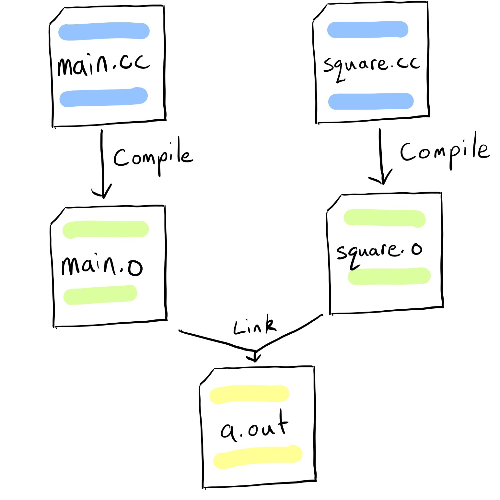

# 编程语言

## 程序的编译和链接

任何编译型编程语言都会经过编译、链接形成可执行文件或库文件，供用户运行或调用。



一份源代码在编译后会形成一个 object file。它包含多个区域 (section)，常见的区域有 .text（指令区，通常包括编译出来的指令），.data（全局变量区，通常包括非零的 static 变量），.rodata（只读全局变量区，通常包括 const 变量、只读字符串等），.bss（全零全局变量区）；同时此时有很多符号 (symbol) （例如函数名和变量名）尚待链接时解析。

链接时会首先把同名区域合并成大区域；类似功能的区域归为一个段 (segment)；然后解析符号，把其他 object 符号对应信息填入待解析处；最后填入 metadata，比如程序目标平台（例如 arm-linux-gnueabi）、入口 (entry)、文件结构等。多个 object file 链接形成库文件或可执行文件，在 Unix 上通常是 [ELF](https://ctf-wiki.org/executable/elf/structure/basic-info/) 格式，Windows 上是 PE 格式。

大部分编译产物都是“位置依赖”的，其入口地址是确定的，其内部可能会用绝对地址来访问某个符号。而在加入 `-fPIC` 选项后会编译成位置无关代码 (position independent code, PIC)，其内部所有符号都是 PC 寻址。

## 汇编

汇编 (assembly) 语言是最接近可执行二进制的语言。最早的汇编由标记和指令组成，它几乎只是指令和数据的人可读的翻译/表述，任何可执行二进制也可以无损翻译成汇编；这部分只要查文档就能读懂。例如如下的 arm64 汇编

```arm
_entry:
    mul w0, w0, w0
    br  x30
```

对应值 `00 7c 00 1b` `c0 03 1f d6` (little endian)。CPU 在执行的时候只需内存中一个个指令读+执行过来。

现代一些汇编编译器加入了一些扩展语法。

首先是伪指令 (pseudo instruction)。有些指令并非真实存在，但可以用一条真实指令代替，编译器会预定义对应宏。arm64 里常用的如下：

| 伪指令 | 真实指令 | 作用 |
| :- | :- | :- |
| `call <fn>` | `bl <fn>` | 跳转到 `<fn>` 函数并把 PC+4 存到 `x30` 里 |
| `ret` | `br x30` | 跳转到 `x30` 包含的地址 |
| `mov <dst>, #imm` | 若立即数很长可能翻译成多个 `movk <dst>, #imm16, lsl #shift` | 把立即数放到寄存器里 |
| `nop` | `mov x1, x1` 之类的 | 无操作 |
| `cmp` | `subs xzr` | 比较并设置 flags |

编译器通常会翻译成真实指令，因此最好记下来上面的真实指令，以免看到反编译/汇编代码不认识是 call/cmp 等。

然后是汇编器指令 (assembler directive)，通常以 `.` 开头。完整的支持列表可以搜索汇编器相关文档，这里记录一些常用的：

- `.balign/.p2align <num>`: 对齐到 `num` / 2^`num` 字节。不要使用 `.align` 因为它在不同平台中会在 `num` / 2^`num` 上有歧义
- `.section <name>(, "<flags>)"`: 指定 section 名（见上面），flag 定义可见 [GNU 文档](https://ftp.gnu.org/old-gnu/Manuals/gas/html_chapter/as_7.html#SEC119)。通常在指定 `.text` 和 `.data` section 时会直接使用 `.text` 和 `.data` 指令而不用 `.section .text/.data`（可以当作语法糖？）
- `.space <num>`/`.skip <num>`: 跳过 `<num>` 字节
- `.globl <sym>`/`.global <sym>`: 声明一个链接器可见的符号 `<sym>`
- `.float/.single/.double/.bytes/.short/.word/.int/.long/.quad/.uleb128/.sleb128 <num>`: 填充一个数值，具体含义如其名
- `.ascii`/`.asciz`/`.string`: 填充一个字符串，`.asciz` 和 `.string` 会自动加上末尾的 `\0`
- `.macro`/`.if`/`.rept`/`.set`: 宏相关指令，不过多介绍（比较简陋，个人认为还是写个小脚本展开后复制粘贴到汇编比较好）

## C 和 Rust

C 和 Rust 作为特性丰富的编程语言，不是两三句讲得完的。具体的语言学习就不赘述了（建议 [course.rs](https://course.rs/) 入门）。这里仅阐述个人对 C 和 Rust 的理解。

C 和 Unix 相伴而生，数十年的沉淀让 C 成为了最懂 x86 的语言，也成为了所有操作系统的主要语言。cdecl (C declaration) 成为了事实上的唯一标准调用约定；即使不同系统 (MS fastcall) 和语言 (C++ thiscall) 要搞些有的没的，他们一定会兼容 cdecl。

C 简约紧凑。通过结构体和指针，它提供了容器意义上的代数数据类型，带来了单类型丝滑的使用体验；函数的抽象则让代码组织模块化、高效化。用 C 编程的体验相较汇编有质的飞跃。[C 语言的前世今生](https://blog.codingnow.com/2010/06/c_programming_language.html) 一文写得极好，值得参考。

当然，相较一些“高级语言” C 似乎缺失了类以及其带来的真·代数数据类型：构造，析构，继承，重载，虚函数，泛型、RAII，多么美味的特性！但当真正开始写代码后，我发现 C++ namespace、class 层层嵌套的结构、各种重载、自动类型转换、泛型类型兼容、半RAII半拷贝、异常捕获等等问题带来了很重的心智负担和性能妥协，一不小心就写出了 bug 了；这远不如 C struct - function 的平铺直叙和直接拷贝来的爽快。

Rust 是一个比较好的折中。它没有实现完整的类型系统，取而代之的是强大的宏系统（与真类型系统生成代码没有区别）和完全 cdecl 兼容的方法。同时它也遵循了 C 贴近底层的哲学，没有轮椅式的重载和自动类型转换之流，而是切其本质：不同的函数调用而已。在写 Rust 时我能拥有和写 C 时一样的对于生成代码完全掌握的自信（并非完全）。

Rust 特有的所有权机制实现了完全体的 RAII，从而让开发者从“这个对象有没有 free 啊”、“这个指针是不是悬空啊”的烦恼中走出，又一层自信！

Rust 还有一个常常被忽视的独门绝技：构建系统。

项目内，C/C++ 须头源分离，而所有源须在构建脚本 (gmake, automake, cmake) 中手动列出；Golang 一个文件夹一个 module，跨 module 要写长长一串的 import 名；而 Rust 提供文件内、同文件夹、子文件夹三种选择，通过源码内的的引用自动编译时引入文件。

项目间，C/C++ 须事先安装到系统或下载一份源代码；Golang 须用一个 git 仓库或是手动 replace 到本地文件夹；而 Rust 提供了本地、crates.io、git 仓库三种默认支持的选择。从而能够轻松地应对大小项目。

不过，Rust 也面临着很多挑战。首先是生态不够发达，最高性能的算法和冷门的场景大多只有 C/C++ 实现；其次随着用户的涌入，很多低质量的 Rust 代码进入了 crates.io，Rust 社区风气逐渐流于所谓 Rusty 的花哨包装而抛弃了简单高效，得了 C++ 社区的病。

Linus 在陈述其拒绝为 kernel 引入 C++ 理由时说：

> C++ is a horrible language. It’s made more horrible by the fact that a lot of substandard programmers use it, to the point where it’s much much easier to generate total and utter crap with it. Quite frankly, even if the choice of C were to do *nothing* but keep the C++ programmers out, that in itself would be a huge reason to use C.

Rust 是一个设计还算良好的语言，希望大家不会成为 Linus 口中的 substandard programmer！

## Rust 内联汇编

我之前翻译了 Rust by Example 的内容，可以作为参考：[链接](https://blog.wsm.moe/2024/10/rust-%E5%86%85%E8%81%94%E6%B1%87%E7%BC%96/)