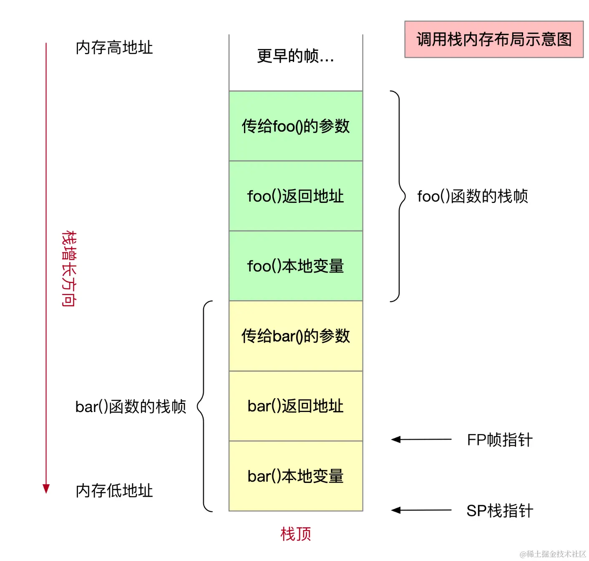

# 函数，特权级与系统调用

## 函数和 cdecl

函数式编程是现代编程的通行做法。只要你接触过任何编程语言，你对“函数”这个概念就不会陌生。

cdecl (C declaration) 函数式编程中，要求至少有一个“调用栈”，有一个寄存器作为“栈指针寄存器” (stack pointer, sp)。栈指针初始指向栈的最高地址/栈底；每调用一个函数栈指针就下移，这段空间就成为了函数的栈帧，可以在函数内部自由使用。

下图是一个典型的 x86 栈结构图。一个栈帧里从高向低存了参数、返回地址指针和局部变量。在 arm 和 riscv 中不用栈，而是用“返回地址寄存器” (link register, lr) 储存返回地址。



函数被调用时，首先会设置参数，根据调用约定通常前几个参数放到寄存器里，其他参数放到栈上；接着会执行一个调用指令，它把下一条指令的地址存到 lr 中，并把 CPU 的执行地址寄存器 (program counter, pc) 设为被调用函数的地址，从而“跳转”到调用函数；然后在函数内部开头 (prologue) 会修改 sp 为局部变量分配空间。

在函数结尾 (epilogue)，通常先修改 sp 归还栈空间，然后通过返回指令修改 pc 为 lr，跳转回上层函数。

这过程主要讲究的就是个“栈平衡”，即在函数内部用多少申请多少；函数调用前后 sp 不能改变，否则函数的栈帧就被破坏了！除此之外，根据不同架构和操作系统的调用约定 (calling convention)，有些寄存器 (callee-saved registers) 也需要被保护起来（如 arm64 中的 x19 ~ x28）；通常一个函数若要使用 callee-saved register 就会把他 push 到栈里，用完后 pop 回来（即先降 sp、save，再 load、升 sp）（看似多此一举，但是在使用寄存器很多时还是很有用的）。

arm 的调用约定：参数1~参数8 分别保存到 x0~x7 寄存器中 ，剩下的参数从右往左依次入栈，被调用者实现栈平衡，返回值如果一个寄存器放得下就存放在 x0 中，放不下调用者要分配空间给返回值，然后把 x8 设为其指针。x29 存栈帧指针，x30 作为 link register 存返回地址，x31 作为 stack pointer 存栈指针。不同语言不同平台细节会不太一样，但大体遵循这个约定。

例如一个函数：

```rust
fn square(x: i32) -> i32 {
    blackbox();
    x*x
}
```

可以编译成汇编

```arm
square:
    sub     sp, sp, #16
    str     lr, [sp, #8]
    str     w0, [sp]
    bl      blackbox
    ldr     lr, [sp, #8]
    ldr     w0, [sp]
    mul     w0, w0, w0
    add     sp, sp, #16
    ret
```

这段代码首先把 sp 减去 16 ，为函数的局部变量分配了 16B 栈空间（calling convention 一般要求栈空间 16B 对齐），然后把 link register (lr/x30) 中的返回地址和第一个参数 `w0` 存到栈中，因为他们可能会被 `blackbox` 调用修改；然后 `bl` 指令跳转到 `blackbox` 函数并将 `lr` 寄存器设为下一条指令 (`ldr w0, [sp]`) 的位置；调用完成返回后再加载回 `lr` 和 `w0`；然后计算 w0 <- w0*w0，作为返回值；最后把 sp 加上 16 归还栈空间，再返回。

btw 栈为什么从高向低呢？我个人认为是历史因素：Intel 为 x86 加入了 push pop call ret 等方便的指令强依赖于上述函数结构，从而让所有编译器和所有架构都沿用了这一设计，从而沿用至今。个人认为这个设计让栈溢出更容易利用为代码注入，不是很好。

## 特权级

现代的操作系统基本都是用户-内核设计，用户程序被认为不可信，他们通过系统调用通过鉴权经由内核进行操作。这就好比网站架构中的前后端一样，用户应尽量少地信任，其任何操作都要经过鉴权，经由可信的后端代理进行。权限的设计大大增强了现代操作系统的稳定性，让即使是恶意程序也难以做出破坏。

操作系统权限设计基于硬件特权级机制支持。所有现代 CPU 架构都实现了特权级机制和软中断指令：
- x86: ring0（宿主/OS）和 ring3 （用户），syscall 指令
- arm：EL2/3（宿主）, EL1（OS）和 EL0（用户），swi/svc 指令
- riscv：M（宿主），S（OS）和 U（用户），ecall 指令

（LoongArch? 不熟...）

特权特权，主要特殊在对硬件访问权限更高。低特权态需要利用/通过高特权态执行部分操作。

在操作系统启动中，会在高特权级/内核态做最基本的初始化，比如系统模块初始化、外设检测和初始化等，然后迅速进入低特权级/用户态，让用户程序开始运作。

## 异常控制流和系统调用

当低特权级下 CPU 遇到异常 (exception) 时（例如非法访存、非法指令、中断 (interrupt)...）\*，会停下当前执行的工作，陷入高一级特权级；操作系统会在初始化时把 CPU 的 trap handler / interrupt service routine (isr) 设为系统自身的，从而在发生异常时被 trap handler 捕获 (trap)。

\*: 这里我将中断归为异常的一类；也有人认为异常是软件触发的，而中断是硬件触发的，二者都会被 trap handler 捕获。不过我个人认为也有软中断的存在，因此将中断归为一类异常。

系统调用 (System Call, syscall) 实质上是软件触发的可控异常/软件中断；被 trap handler 捕获后会根据参数决定调用的函数，并向它传参。这个过程其实蛮类似于普通的函数调用，只是把 call 指令换成了软中断指令；而在返回时加上特权级切换。

例如 `int fd = open("out", 1);` 会被编译成

```arm
    adrp    x0, .OUT
    add     x0, x0, :lo12:.OUT
    mov     w1, #1
    mov     x8, #5
    svc     #0
.OUT
    .string "out"
```

这是一个典型的系统调用过程。前面几行就是正常的参数加载，最后的 `svc #0` 执行软中断，转入内核态进行处理。内核处理完后转回用户态，仿佛一个函数调用正常返回一样。

