# rCore-OS 笔记

本书原本计划为 [rCore-OS](https://rcore-os.cn) 完整实现笔记；然而在实现过程中发现其过于依赖于已有的库，包装掉了一些其实还蛮重要的细节。又考虑到基于 x86 和 riscv 的操作系统教程一大把，~~我最喜欢的~~ 现实中相当常用的 arm 却比较少。因此本书希望逐步实现一个基于 aarch64 的、简陋而完整的操作系统。

本书希望
- 尽量自洽，少依赖本书以外的知识；若有涉及本书会简单介绍
- 系统兼容部分 Linux syscall
- 不涉及更高级功能的前提下推进系统的开发，即使是单片机开发者也能从本书中受益

本书基于 Rust，要求读者熟悉 C 并且有一定 Rust 基础（推荐 [course.rs](https://course.rs/) 入门）。

## 操作系统

私以为，现代操作系统的职能有二
- 把硬件资源安全地共享给多任务 (multiplexing + isolation)
- 把硬件操作包装为安全统一的系统调用 (abstract hardware)

*当然用户和权限控制 (permission / access control) 也是很重要的部分，但是它实现原理很简单，却涉及内核代码的方方面面，我们在本书中会有意忽略它。*

这就是对于操作系统的一个快速预览。内核通过进程、文件系统、内存管理、虚拟总线四个模块抽象硬件，供用户态程序通过系统调用 (System Call) 使用。

## 参考资料

- MIT6.S081
- [Writing an OS in Rust](https://os.phil-opp.com/)
- [blogOS-armV8](https://os2022exps-doc.readthedocs.io/zh-cn/latest/index.html) ([github repo](https://github.com/phil-opp/blog_os))
- [leos-kernel](https://github.com/lowenware/leos-kernel)
- [Linux 内核揭秘](https://xinqiu.gitbooks.io/linux-insides-cn/)